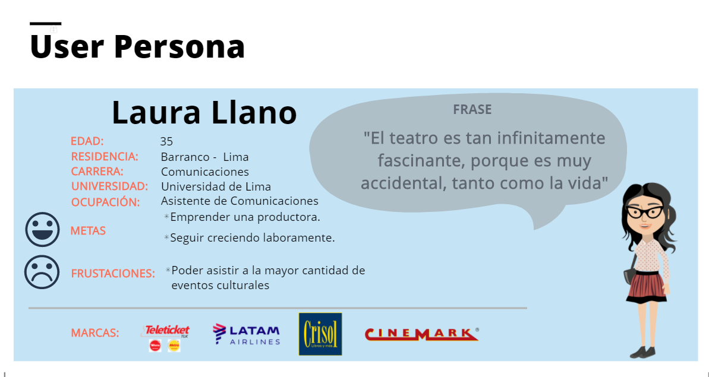
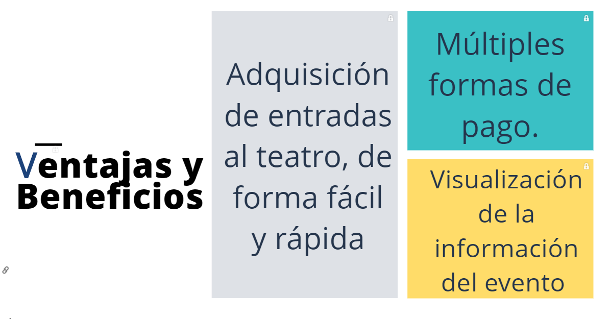

# Joinnus (Teatro)

Joinnus es una plataforma digital que congrega la mayor cantidad de eventos del país y en la que se puede comprar entradas en segundos, pagando en línea o en efectivo. Esta herramienta digital es muy potente para los organizadores de eventos ya que en minutos les permite crear, difundir y vender entradas teniendo el control y métricas de sus eventos en tiempo real.

## Reto

## Research

### Entrevistas y Encuestas:

  Realizamos entrevistas y encuestas para conocer los requerimientos y necesidades de lo usuarios a la hora de adquirir tickets de forma online para asistir a una función de teatro.
  Para ello nos enfocamos en el público asistentes del Teatro Luigi Pirandello y usuarios potenciales; con el fin de conocer sus apreciaciones antes, durantes y después del proceso de compra de tickets y su experiencia durante el uso de la web (Atrápalo Perú y Teleticket Perú).

  * Conclusiones de las Entrevistas

  

  * Resultados de las encuestas online

  

### Etapa Previa:

  * Recolección de Información Previa:

  * Benchmarck

  

### Síntesis y Definición

  * ¿Qué debe proveer la compra de tickets para Teatro de Joinnus?

  

  

## Detalles de la Propuesta (JOINNUS "TEATRO")

### User Persona:

  

### Escenario:

  

### Problem statements & How might we?

  

### BMC:

  

### Elementos que contendrá Joinnus "Teatro":

  

### Objetivos de Joinnus "Teatro":

  

### Ventajas y beneficios que Joinnus "Teatro" debe ofrecer:

  

### Ideación:

  

## Prototipado

### Actividades:

  * Se utilizó Figma para el desarrollo de las vistas.

  * Se utilizó Marv el para darle interacción a las vistas del Prototipo.

### Prototipo Alta Fidelidad Deskopt:

  [Ver Prototipo Deskopt](https://marvelapp.com/6661bid/screen/40659285)

### Prototipo Alta Fidelidad Movil:

  [Ver Prototipo Movil](h)

## Testing

### Feedback:

  * Se realizacisó iteraciones con 5 amantes del teatro (Miriam Germán Karts / Laura Yramátegui Lozano / Mauricio Malpartida Morales/ Franco Finocchiaro / Teresa Quispe Espino).

  * Al usuario le pareció agradeble la visualización  de la información.

  * Le agradó lo ilustrativo del plano del teatro.

  * Se perdía un poco, si decidía elegir otro sector.

  * No sabría cómo elegir entradas de diferentes sectores en una misma transacción.
